# CSS reference

[Basic example](https://dance.archi/scrollbars/) · [Every option, live](https://dance.archi/scrollbars/options.html)

## IE properties

These are the old Internet Explorer declarations. Put them on `body` for page scrollbars, or on an element with `overflow: auto` or `overflow: scroll`. Both axes are supported.

```css
body {
  scrollbar-face-color: #ffb6d9;
  scrollbar-arrow-color: #800040;
  scrollbar-highlight-color: #fff;
  scrollbar-shadow-color: #ba5e86;
  scrollbar-darkshadow-color: #800040;
  scrollbar-track-color: #ffe5f0;
}
```

Use `<style>` blocks or same-origin stylesheets, including same-origin `@import` and matching `@media` rules. The raw reader also recognises inline declarations, but browsers can discard those during wrapper setup. Element rules override page colours; page rules fill unspecified colours. Hex colours need a `#`. `-ms-scrollbar-*` aliases are not read.

Each screenshot compares the unchanged setting with one changed value. Click to enlarge. Examples use 32px bars to make the details visible; the normal size is 16px.

| Property | Default | What it does | Example |
| --- | --- | --- | --- |
| `scrollbar-face-color` | `#C0C0C0` | Button and thumb fill. | <a href="images/css/scrollbar-face-color.png">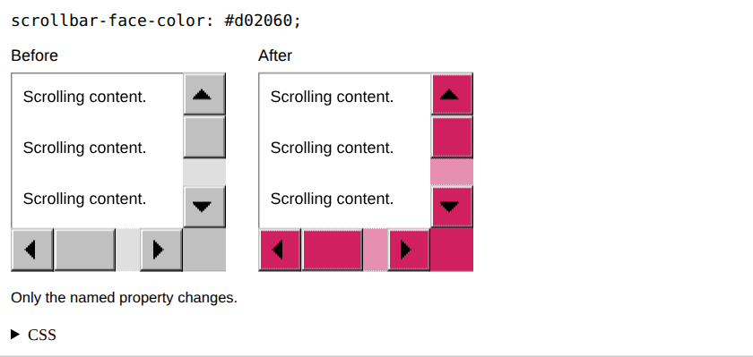</a> |
| `scrollbar-3dlight-color` | `#C0C0C0` | Outer top and left bevel. | <a href="images/css/scrollbar-3dlight-color.png">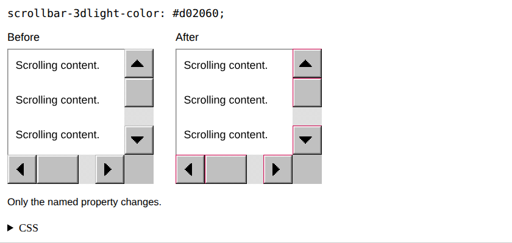</a> |
| `scrollbar-highlight-color` | `#FFFFFF` | Inner top and left bevel. | <a href="images/css/scrollbar-highlight-color.png">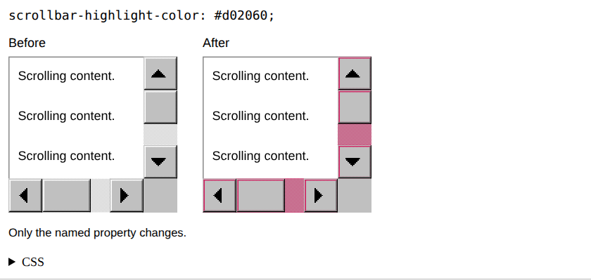</a> |
| `scrollbar-shadow-color` | `#808080` | Inner bottom and right bevel. | <a href="images/css/scrollbar-shadow-color.png">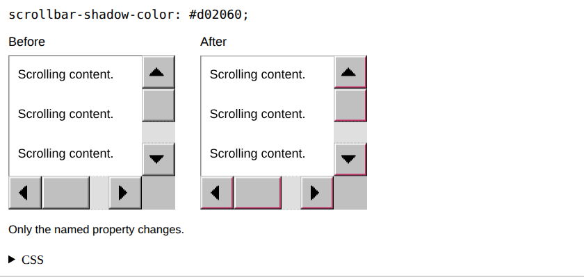</a> |
| `scrollbar-darkshadow-color` | `#000000` | Outer bottom and right bevel. | <a href="images/css/scrollbar-darkshadow-color.png">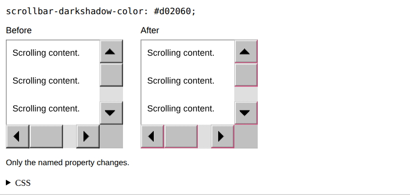</a> |
| `scrollbar-arrow-color` | `#000000` | Arrow colour. | <a href="images/css/scrollbar-arrow-color.png">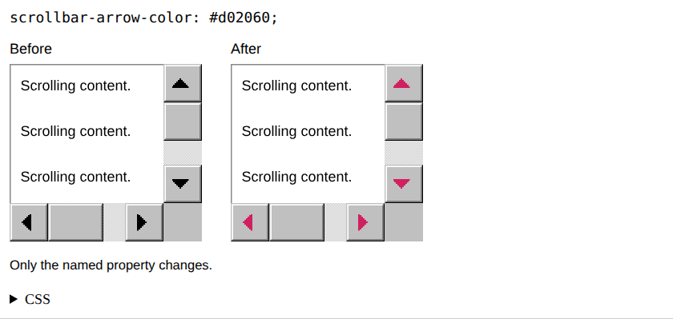</a> |
| `scrollbar-track-color` | `#C0C0C0` | Track fill; replaces the checkerboard. | <a href="images/css/scrollbar-track-color.png">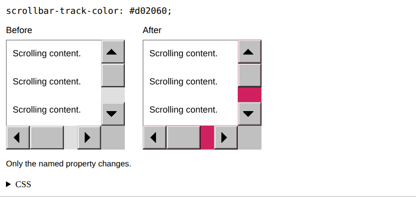</a> |
| `scrollbar-base-color` | Ignored | Recognised but ignored by this script. Set the individual colours instead. | <a href="images/css/scrollbar-base-color.png">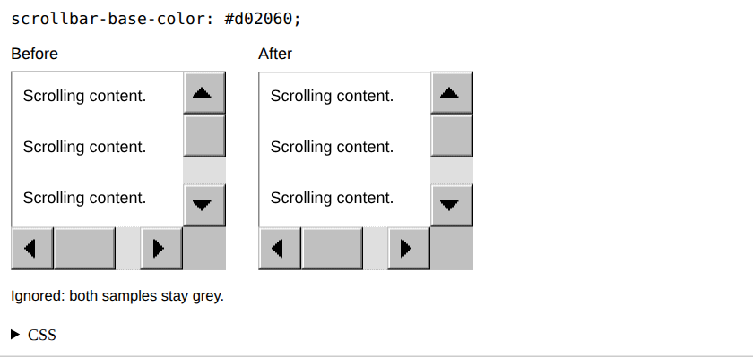</a> |

`scrollbar-base-color` is listed for completeness, but is ignored. The JavaScript `setBaseColor()` method can generate an approximate palette; it does not reproduce IE's original formula.

## New custom properties

These are additions to the original IE options.

Set `--ie-scrollbar-*` on the scrolling element **before it mounts**. The script copies them to its wrapper at mount time; `IEScrollbarAuto.rescan()` does not refresh the copied values. For page scrollbars, set them on `body` or `:root`.

Use literal `px` values for bar size, minimum thumb size, button size, and border inset. Those are parsed by JavaScript. Other lengths use normal CSS. Boolean switches require exactly `1`; leaving them unset keeps the default. “Start” means up/left; “end” means down/right.

```css
.scrollbox {
  overflow: auto;
  height: 200px;
  --ie-scrollbar-size: 24px;
  --ie-scrollbar-glyph-start-shape: dot;
  --ie-scrollbar-glyph-end-shape: square;
}
```

### Palette aliases

Set these on a **parent** of the scrolling element so the generated wrapper inherits them. Original IE declarations are applied on the wrapper and take precedence over inherited aliases.

| Property | Default | What it does | Example |
| --- | --- | --- | --- |
| `--ie-face` | `#C0C0C0` | Button and thumb fill; corner fill; first track dither colour. | <a href="images/css/ie-face.png">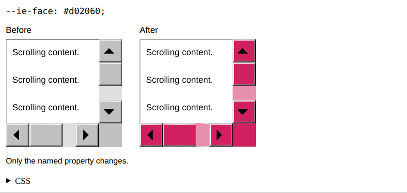</a> |
| `--ie-3dlight` | `#C0C0C0` | Outer top/left bevel. | <a href="images/css/ie-3dlight.png">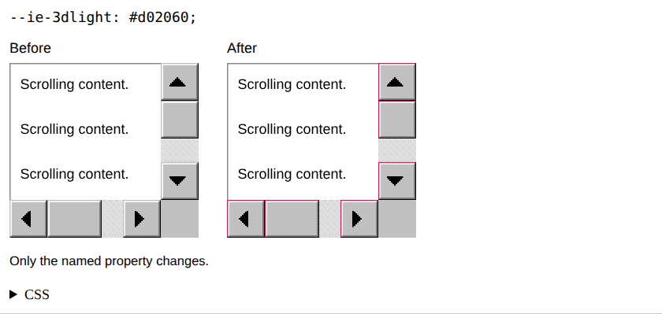</a> |
| `--ie-highlight` | `#FFFFFF` | Inner top/left bevel; second track dither colour. | <a href="images/css/ie-highlight.png">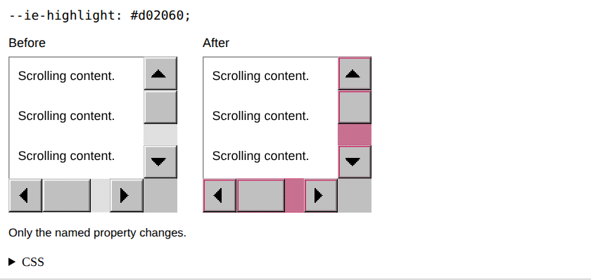</a> |
| `--ie-shadow` | `#808080` | Inner bottom/right bevel. | <a href="images/css/ie-shadow.png"></a> |
| `--ie-darkshadow` | `#000000` | Outer bottom/right bevel. | <a href="images/css/ie-darkshadow.png">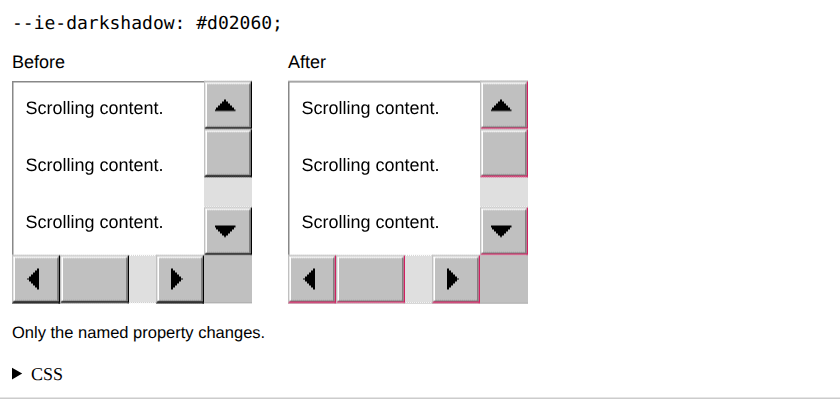</a> |
| `--ie-arrow` | `#000000` | Arrow glyph fill. | <a href="images/css/ie-arrow.png">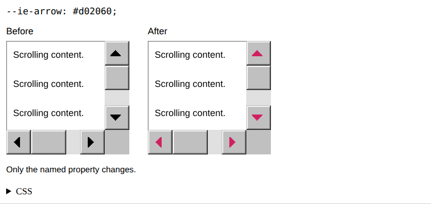</a> |
| `--ie-track` | `#C0C0C0` | Fill for a custom flat track; this value alone does not turn off dithering. | <a href="images/css/ie-track.png">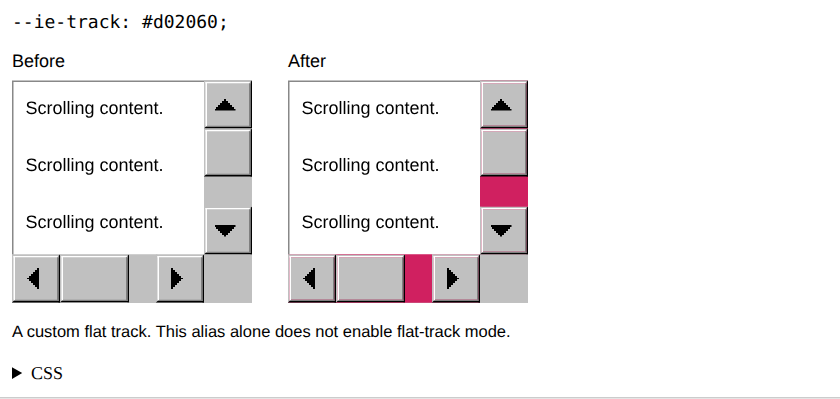</a> |

`--ie-track` supplies a flat-track colour but does not activate flat-track mode on its own. Use `scrollbar-track-color` for a flat track, or the two dither colours to keep the checks. Its photo shows an already-flat track.

### Geometry and flags

| Property | Default | What it does | Example |
| --- | --- | --- | --- |
| `--ie-scrollbar-size` | `16px` | Bar thickness and default square button size. | <a href="images/css/ie-scrollbar-size.png">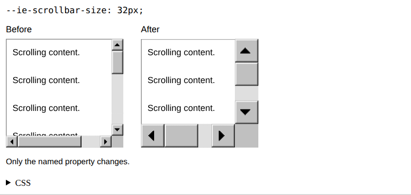</a> |
| `--ie-scrollbar-min-thumb-size` | `32px` | Minimum thumb length, limited by available track space. | <a href="images/css/ie-scrollbar-min-thumb-size.png">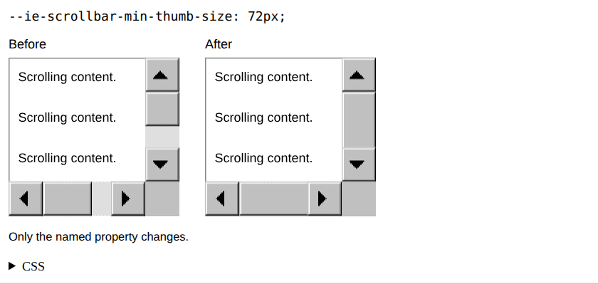</a> |
| `--ie-scrollbar-border-inset` | Auto | Inset from the edge, detected from the right/bottom border. Set explicitly for asymmetric borders. | <a href="images/css/ie-scrollbar-border-inset.png">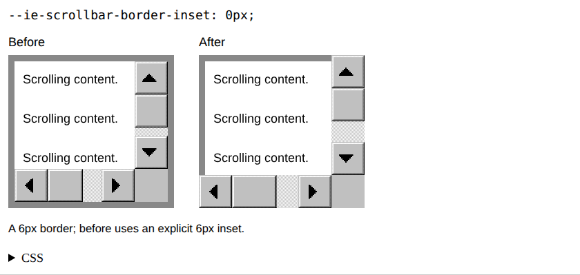</a> |
| `--ie-scrollbar-border-inset-corners` | `1` | Multiply the inset at the bar ends: `0` extends it to the corners; `1` keeps the inset. | <a href="images/css/ie-scrollbar-border-inset-corners.png">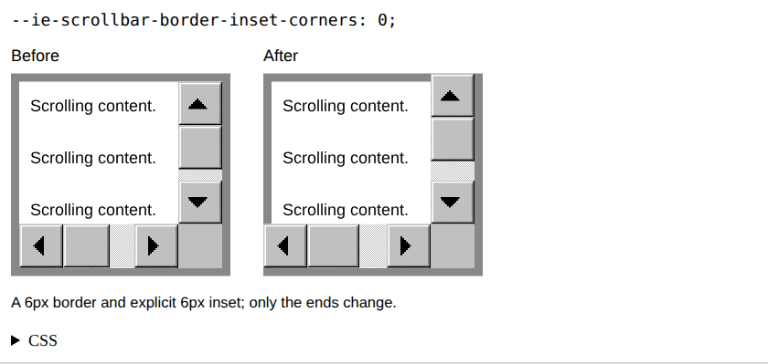</a> |
| `--ie-scrollbar-small-track-half-thumb` | `0` | `1`: use a half-track thumb when the track is shorter than 64px. | <a href="images/css/ie-scrollbar-small-track-half-thumb.png">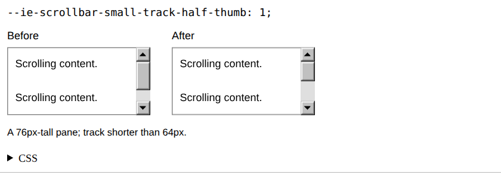</a> |
| `--ie-scrollbar-blocky` | `0` | `1`: square bevel corners and four-row triangle glyphs at every device pixel ratio. Does not change the track pattern. | <a href="images/css/ie-scrollbar-blocky.png"></a> |
| `--ie-scrollbar-smooth` | `0` | `1`: allow triangle/square glyph antialiasing. Dot glyphs are always antialiased. Does not enable smooth scrolling. | <a href="images/css/ie-scrollbar-smooth.png">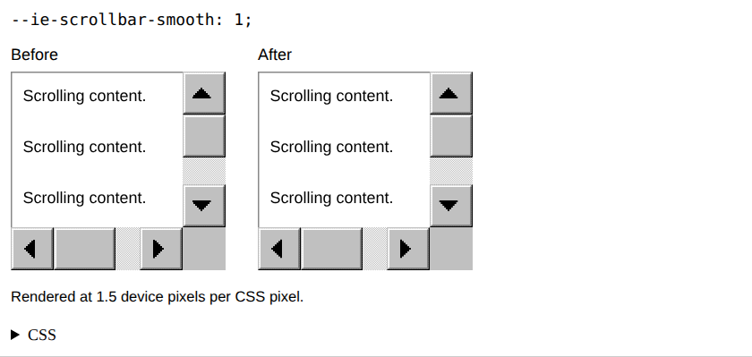</a> |
| `--ie-scrollbar-track-dither-1px` | `0` | `1`: use 1-device-pixel checkerboard cells. Default: floor(DPR) device pixels, at least one. The difference appears at DPR 2 and above. | <a href="images/css/ie-scrollbar-track-dither-1px.png">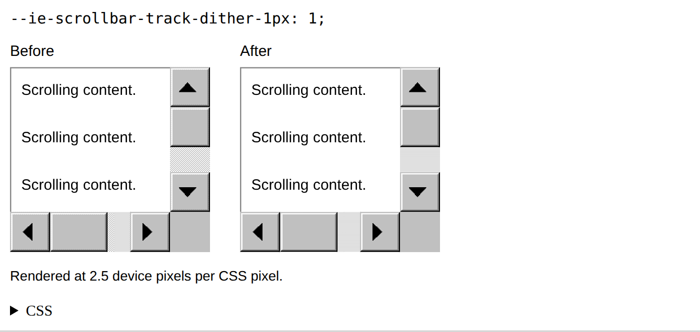</a> |
| `--ie-scrollbar-pressed-invert` | `invert` | `none`: keep button bevels and glyph position unchanged while pressed. Other values use the pressed bevel and 1px glyph shift. | <a href="images/css/ie-scrollbar-pressed-invert.png">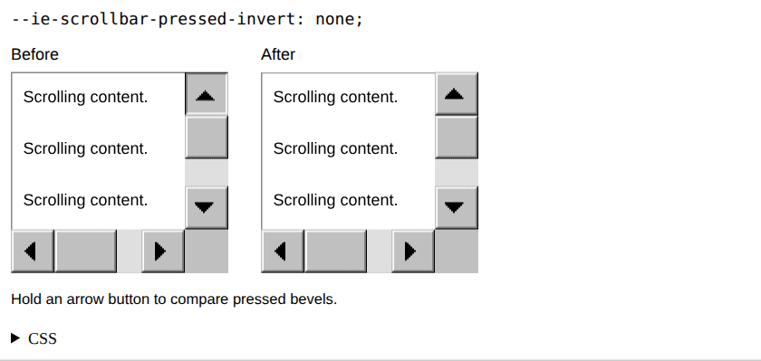</a> |
| `--ie-scrollbar-thumb-pressed-invert` | `none` | `invert`: invert the thumb bevel while dragging. | <a href="images/css/ie-scrollbar-thumb-pressed-invert.png">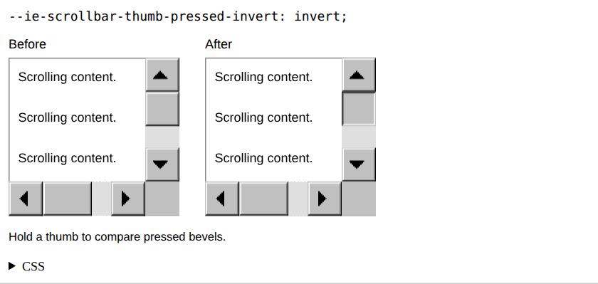</a> |

### Bevels and track

“Light” edges are top/left; “dark” edges are bottom/right. Each edge width falls back to `--ie-scrollbar-bevel-width`. Pressed bevels swap colours, keeping their edge widths.

| Property | Default | What it does | Example |
| --- | --- | --- | --- |
| `--ie-scrollbar-bevel-width` | `1px` | Fallback width for all four bevel edges. | <a href="images/css/ie-scrollbar-bevel-width.png">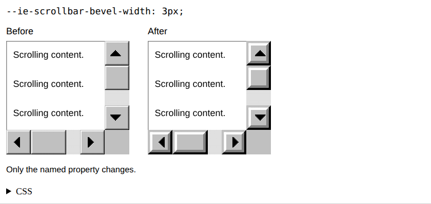</a> |
| `--ie-scrollbar-bevel-outer-light-width` | Bevel width | Width of outer top/left edges. | <a href="images/css/ie-scrollbar-bevel-outer-light-width.png">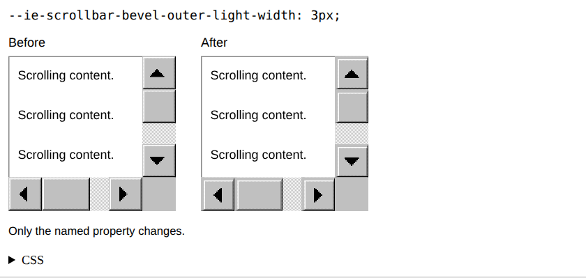</a> |
| `--ie-scrollbar-bevel-outer-dark-width` | Bevel width | Width of outer bottom/right edges. | <a href="images/css/ie-scrollbar-bevel-outer-dark-width.png">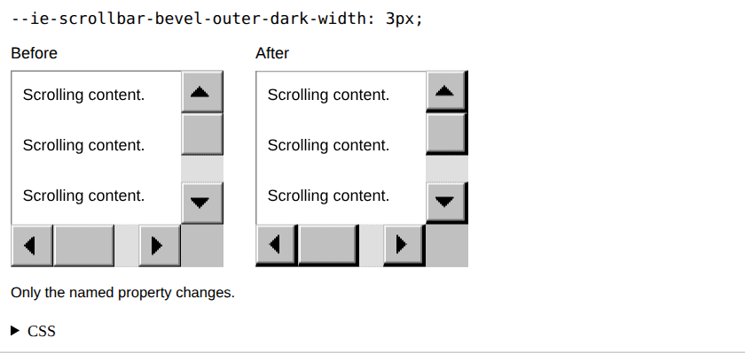</a> |
| `--ie-scrollbar-bevel-inner-light-width` | Bevel width | Width of inner top/left edges. | <a href="images/css/ie-scrollbar-bevel-inner-light-width.png">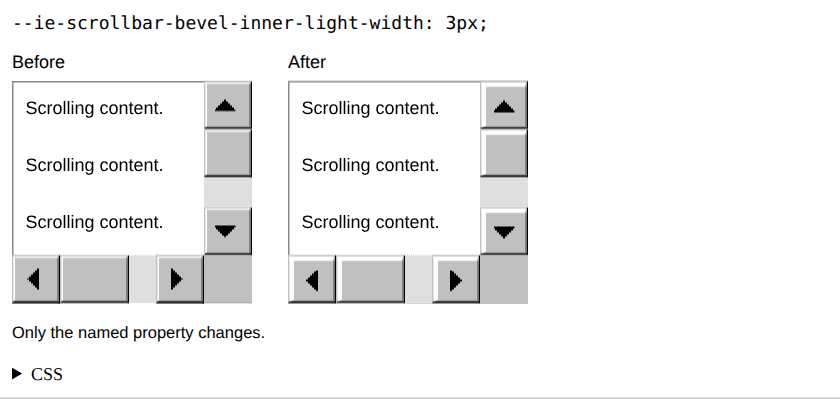</a> |
| `--ie-scrollbar-bevel-inner-dark-width` | Bevel width | Width of inner bottom/right edges. | <a href="images/css/ie-scrollbar-bevel-inner-dark-width.png">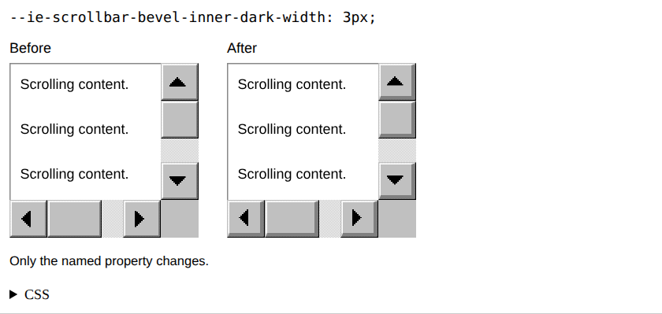</a> |
| `--ie-scrollbar-track-dither-a-color` | `--ie-face` | Colour of checkerboard cell a. | <a href="images/css/ie-scrollbar-track-dither-a-color.png">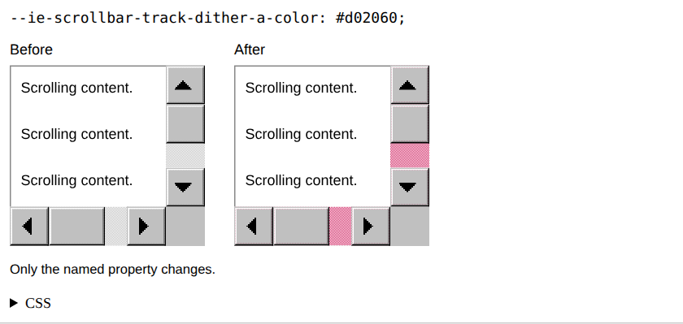</a> |
| `--ie-scrollbar-track-dither-b-color` | `--ie-highlight` | Colour of checkerboard cell b. | <a href="images/css/ie-scrollbar-track-dither-b-color.png">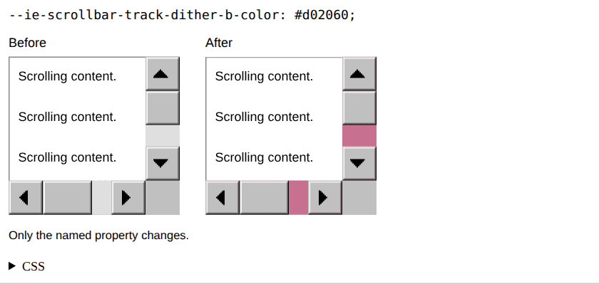</a> |

### Buttons

Buttons are always square. Alignment places a narrower button across the width of a vertical bar, or across the height of a horizontal bar. Disabled arrows keep their direction colour unless overridden.

| Property | Default | What it does | Example |
| --- | --- | --- | --- |
| `--ie-scrollbar-button-start-face-color` | `--ie-face` | Start button fill. | <a href="images/css/ie-scrollbar-button-start-face-color.png">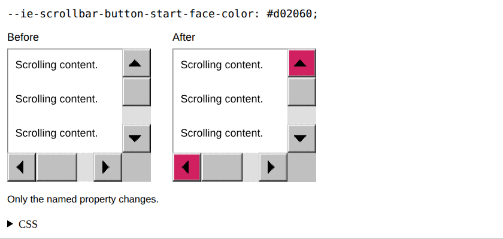</a> |
| `--ie-scrollbar-button-start-3dlight-color` | `--ie-3dlight` | Start button bevel colour. | <a href="images/css/ie-scrollbar-button-start-3dlight-color.png">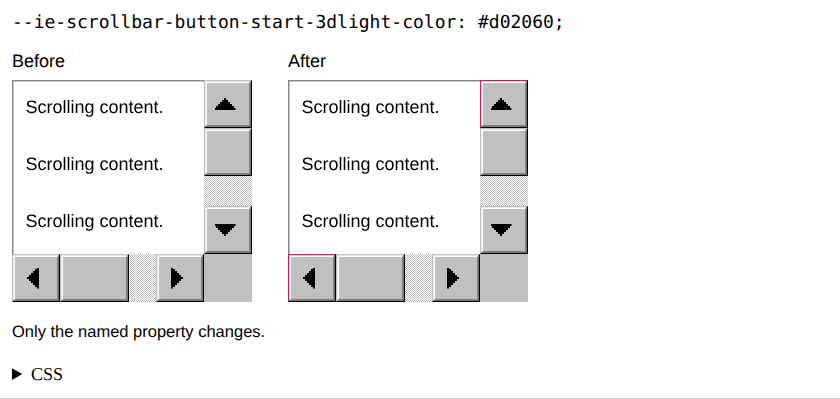</a> |
| `--ie-scrollbar-button-start-highlight-color` | `--ie-highlight` | Start button bevel colour. | <a href="images/css/ie-scrollbar-button-start-highlight-color.png">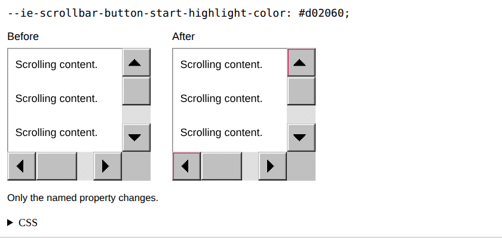</a> |
| `--ie-scrollbar-button-start-shadow-color` | `--ie-shadow` | Start button bevel colour. | <a href="images/css/ie-scrollbar-button-start-shadow-color.png">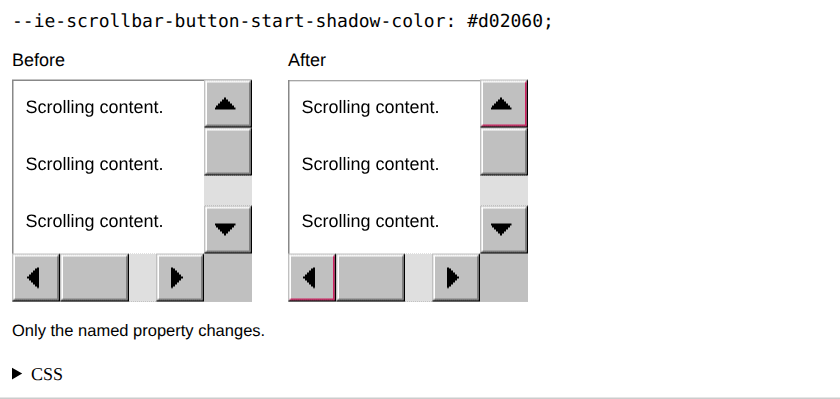</a> |
| `--ie-scrollbar-button-start-darkshadow-color` | `--ie-darkshadow` | Start button bevel colour. | <a href="images/css/ie-scrollbar-button-start-darkshadow-color.png">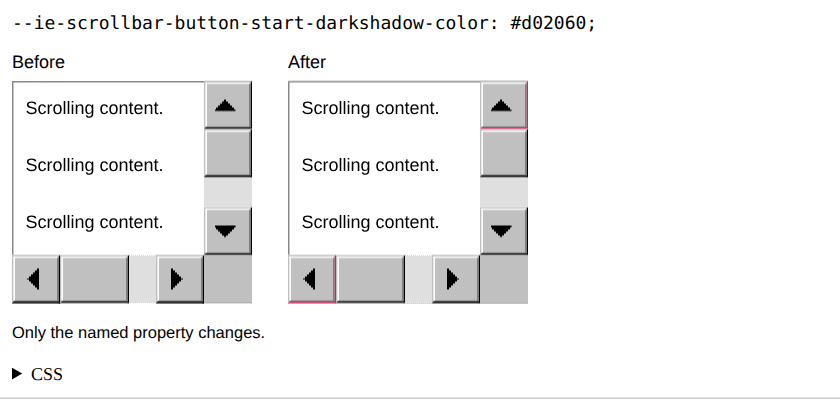</a> |
| `--ie-scrollbar-arrow-start-color` | `--ie-arrow` | Start glyph fill. | <a href="images/css/ie-scrollbar-arrow-start-color.png"></a> |
| `--ie-scrollbar-button-start-size` | Bar size | Square button dimensions; glyph scales with this size. | <a href="images/css/ie-scrollbar-button-start-size.png"></a> |
| `--ie-scrollbar-button-start-align` | `flex-end` | Cross-axis alignment: `flex-start`, `center`, or `flex-end`. Useful for buttons narrower than the bar. | <a href="images/css/ie-scrollbar-button-start-align.png">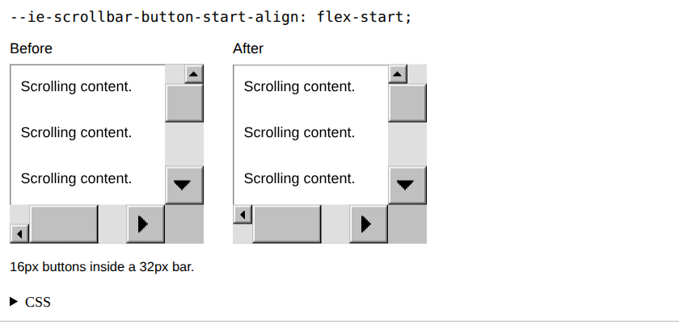</a> |
| `--ie-scrollbar-button-end-face-color` | `--ie-face` | End button fill. | <a href="images/css/ie-scrollbar-button-end-face-color.png">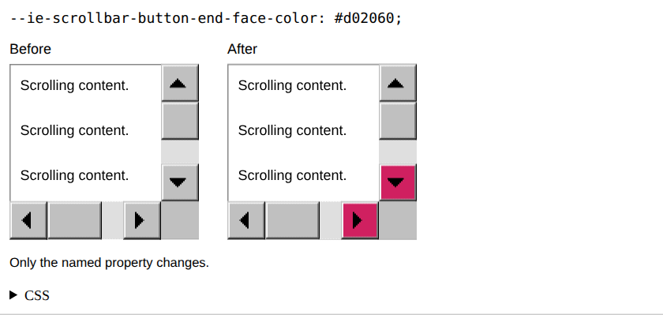</a> |
| `--ie-scrollbar-button-end-3dlight-color` | `--ie-3dlight` | End button bevel colour. | <a href="images/css/ie-scrollbar-button-end-3dlight-color.png">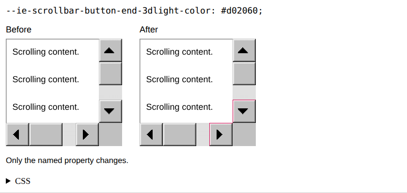</a> |
| `--ie-scrollbar-button-end-highlight-color` | `--ie-highlight` | End button bevel colour. | <a href="images/css/ie-scrollbar-button-end-highlight-color.png">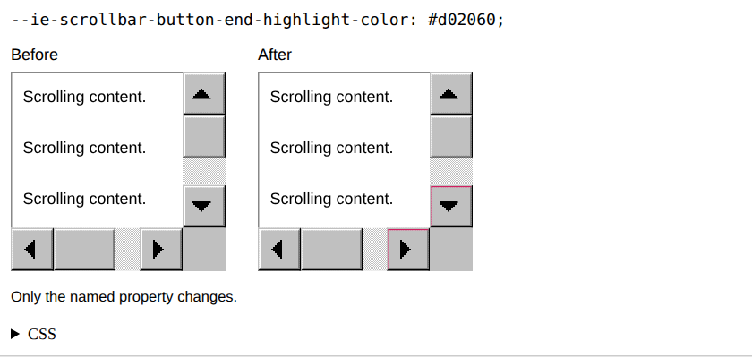</a> |
| `--ie-scrollbar-button-end-shadow-color` | `--ie-shadow` | End button bevel colour. | <a href="images/css/ie-scrollbar-button-end-shadow-color.png">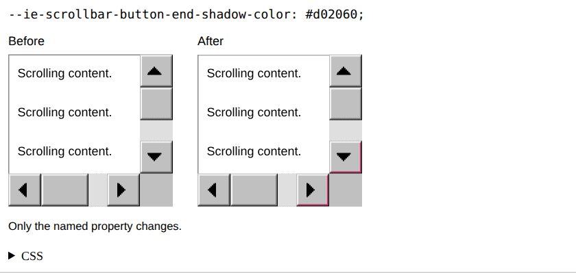</a> |
| `--ie-scrollbar-button-end-darkshadow-color` | `--ie-darkshadow` | End button bevel colour. | <a href="images/css/ie-scrollbar-button-end-darkshadow-color.png">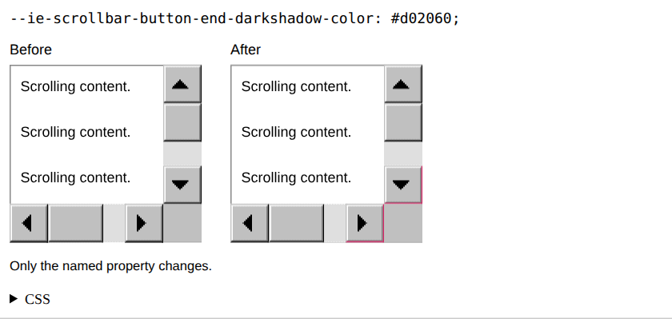</a> |
| `--ie-scrollbar-arrow-end-color` | `--ie-arrow` | End glyph fill. | <a href="images/css/ie-scrollbar-arrow-end-color.png">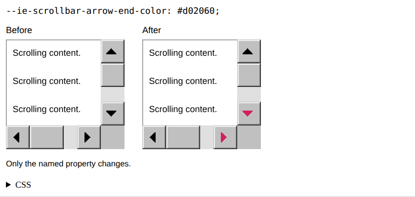</a> |
| `--ie-scrollbar-button-end-size` | Bar size | Square button dimensions; glyph scales with this size. | <a href="images/css/ie-scrollbar-button-end-size.png">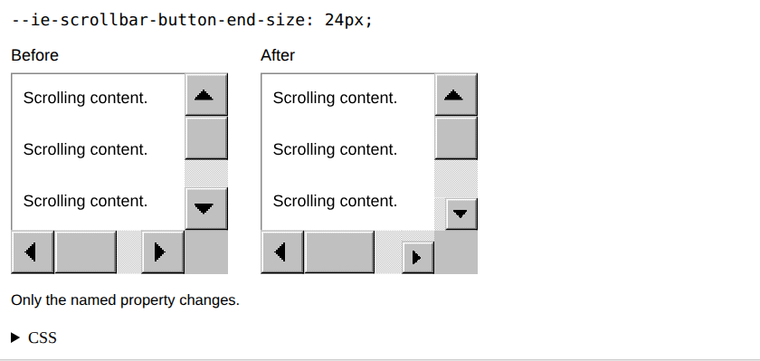</a> |
| `--ie-scrollbar-button-end-align` | `flex-end` | Cross-axis alignment: `flex-start`, `center`, or `flex-end`. Useful for buttons narrower than the bar. | <a href="images/css/ie-scrollbar-button-end-align.png">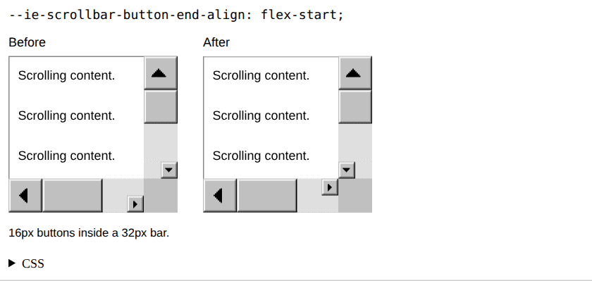</a> |
| `--ie-scrollbar-arrow-disabled-color` | Direction arrow colour | Glyph fill when that direction has reached its scroll limit. | <a href="images/css/ie-scrollbar-arrow-disabled-color.png">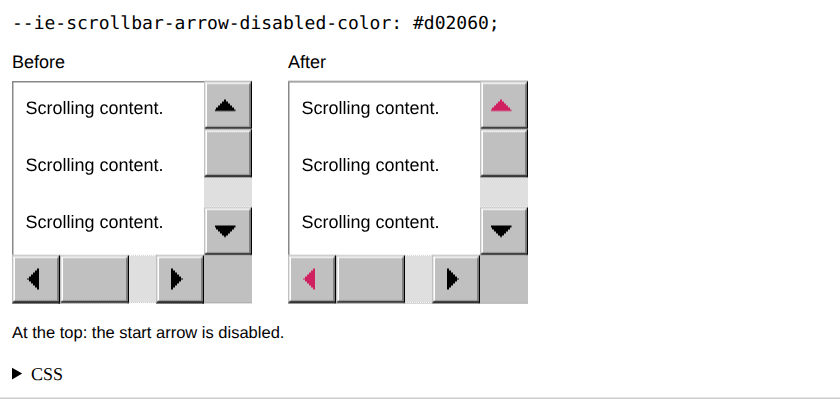</a> |

### Glyphs

A custom image replaces the built-in glyph. Its `size` uses CSS background-size syntax. Offsets apply to built-in glyphs and images; a pressed button adds 1px unless inversion is disabled.

| Property | Default | What it does | Example |
| --- | --- | --- | --- |
| `--ie-scrollbar-glyph-start-shape` | `triangle` | `triangle`, `square`, or `dot`; other values use triangle. | <a href="images/css/ie-scrollbar-glyph-start-shape.png">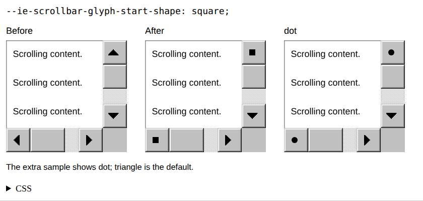</a> |
| `--ie-scrollbar-glyph-start-image` | `none` | CSS image (for example `url(...)`); replaces the built-in glyph. | <a href="images/css/ie-scrollbar-glyph-start-image.png">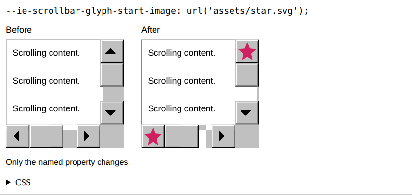</a> |
| `--ie-scrollbar-glyph-start-size` | `contain` | Custom image background size; does not resize built-in glyphs. | <a href="images/css/ie-scrollbar-glyph-start-size.png">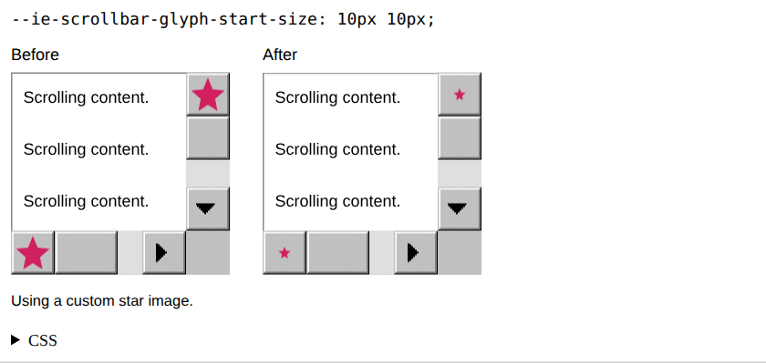</a> |
| `--ie-scrollbar-glyph-start-offset-x` | `0px` | Horizontal glyph offset. | <a href="images/css/ie-scrollbar-glyph-start-offset-x.png"></a> |
| `--ie-scrollbar-glyph-start-offset-y` | `0px` | Vertical glyph offset. | <a href="images/css/ie-scrollbar-glyph-start-offset-y.png"></a> |
| `--ie-scrollbar-glyph-start-center-triangle` | `0` | `1`: center the triangle precisely. The original bias is tiny; the result may look unchanged. | <a href="images/css/ie-scrollbar-glyph-start-center-triangle.png">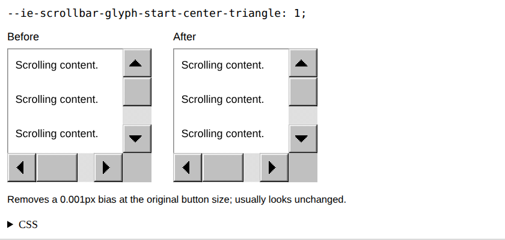</a> |
| `--ie-scrollbar-glyph-end-shape` | `triangle` | `triangle`, `square`, or `dot`; other values use triangle. | <a href="images/css/ie-scrollbar-glyph-end-shape.png">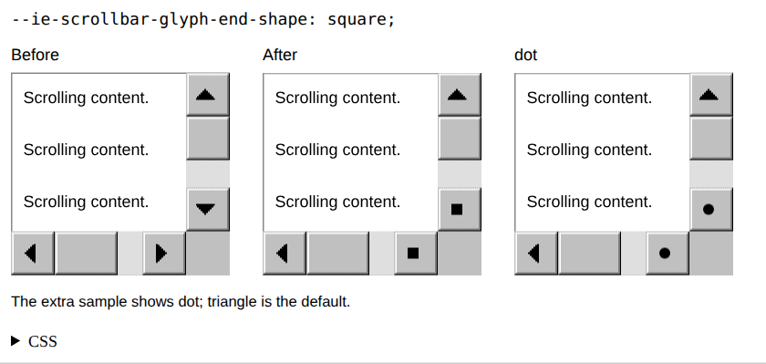</a> |
| `--ie-scrollbar-glyph-end-image` | `none` | CSS image (for example `url(...)`); replaces the built-in glyph. | <a href="images/css/ie-scrollbar-glyph-end-image.png">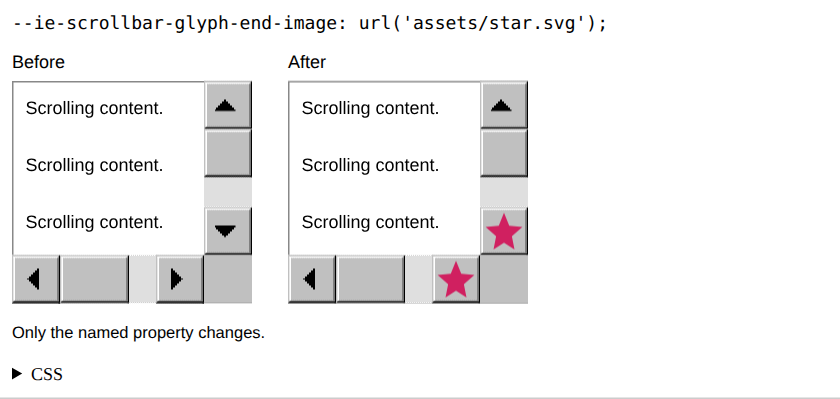</a> |
| `--ie-scrollbar-glyph-end-size` | `contain` | Custom image background size; does not resize built-in glyphs. | <a href="images/css/ie-scrollbar-glyph-end-size.png">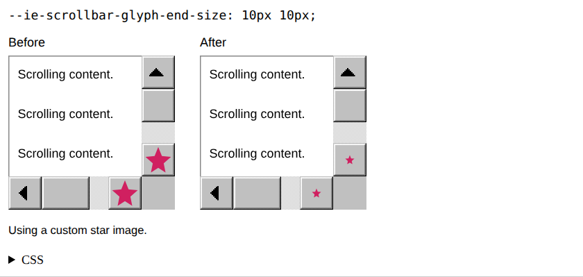</a> |
| `--ie-scrollbar-glyph-end-offset-x` | `0px` | Horizontal glyph offset. | <a href="images/css/ie-scrollbar-glyph-end-offset-x.png"></a> |
| `--ie-scrollbar-glyph-end-offset-y` | `0px` | Vertical glyph offset. | <a href="images/css/ie-scrollbar-glyph-end-offset-y.png">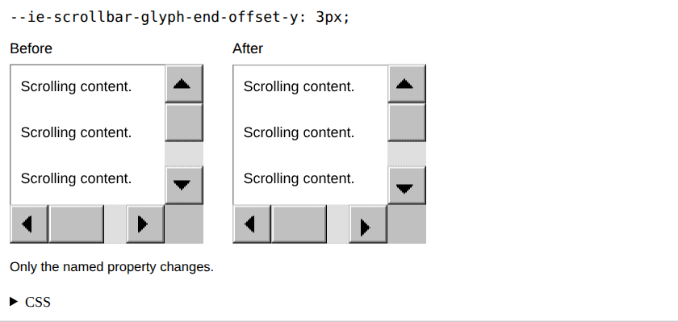</a> |
| `--ie-scrollbar-glyph-end-center-triangle` | `0` | `1`: center the triangle precisely. The original bias is tiny; the result may look unchanged. | <a href="images/css/ie-scrollbar-glyph-end-center-triangle.png"></a> |

### Textures

Images and CSS gradients are accepted. Button and thumb textures sit inside the bevel. Track images replace the checkerboard. The position, size, and repeat fields use their normal CSS background values. Paths below are relative to the example page.

| Property | Default | What it does | Example |
| --- | --- | --- | --- |
| `--ie-scrollbar-button-start-background-image` | `none` | CSS image or gradient. | <a href="images/css/ie-scrollbar-button-start-background-image.png">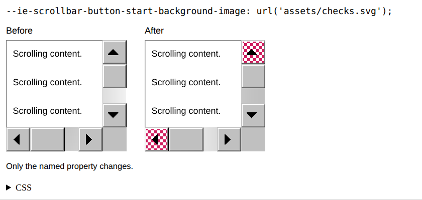</a> |
| `--ie-scrollbar-button-start-background-position` | `50% 50%` | CSS background position. | <a href="images/css/ie-scrollbar-button-start-background-position.png">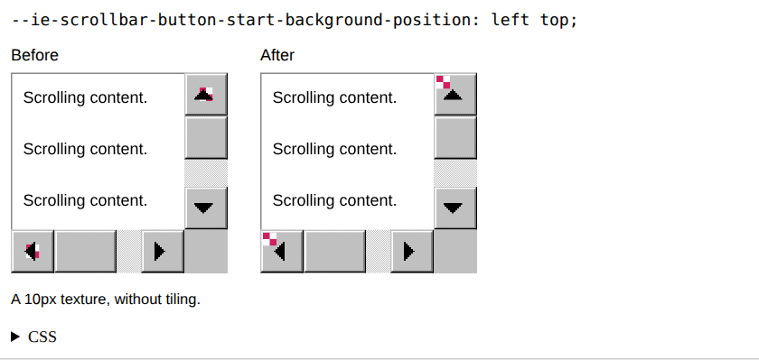</a> |
| `--ie-scrollbar-button-start-background-size` | `auto` | CSS background size. | <a href="images/css/ie-scrollbar-button-start-background-size.png">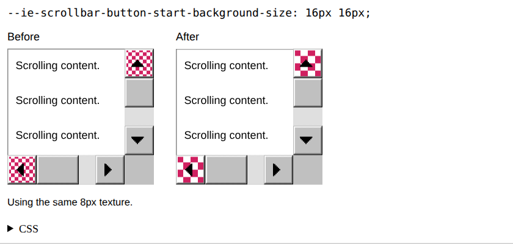</a> |
| `--ie-scrollbar-button-start-background-repeat` | `repeat` | CSS background repeat. | <a href="images/css/ie-scrollbar-button-start-background-repeat.png">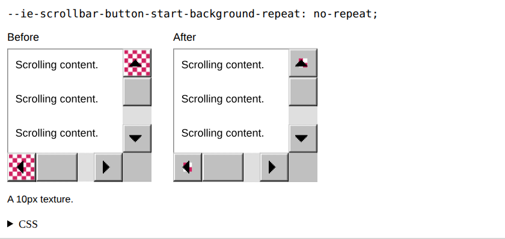</a> |
| `--ie-scrollbar-button-end-background-image` | `none` | CSS image or gradient. | <a href="images/css/ie-scrollbar-button-end-background-image.png">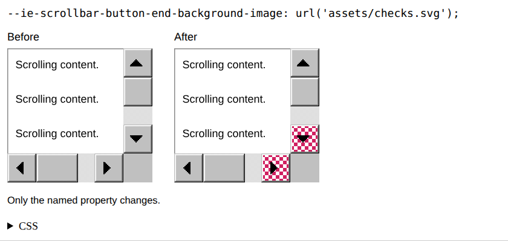</a> |
| `--ie-scrollbar-button-end-background-position` | `50% 50%` | CSS background position. | <a href="images/css/ie-scrollbar-button-end-background-position.png">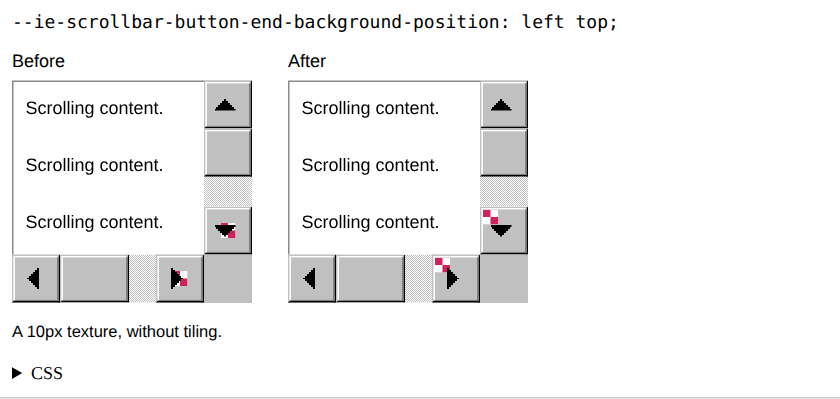</a> |
| `--ie-scrollbar-button-end-background-size` | `auto` | CSS background size. | <a href="images/css/ie-scrollbar-button-end-background-size.png">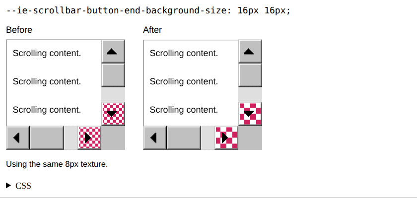</a> |
| `--ie-scrollbar-button-end-background-repeat` | `repeat` | CSS background repeat. | <a href="images/css/ie-scrollbar-button-end-background-repeat.png">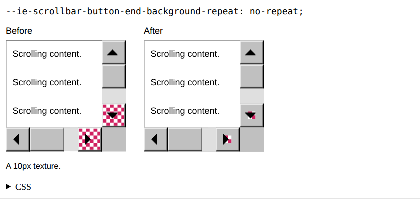</a> |
| `--ie-scrollbar-thumb-background-image` | `none` | CSS image or gradient. | <a href="images/css/ie-scrollbar-thumb-background-image.png">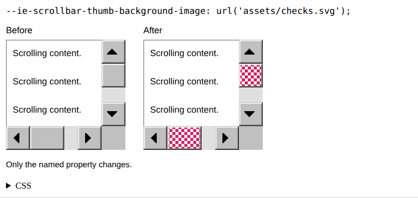</a> |
| `--ie-scrollbar-thumb-background-position` | `50% 50%` | CSS background position. | <a href="images/css/ie-scrollbar-thumb-background-position.png">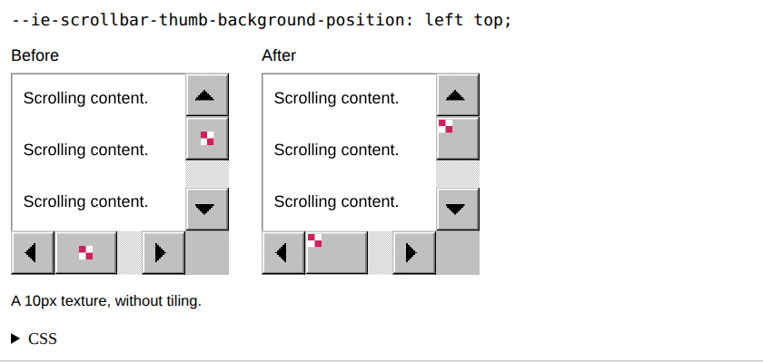</a> |
| `--ie-scrollbar-thumb-background-size` | `auto` | CSS background size. | <a href="images/css/ie-scrollbar-thumb-background-size.png">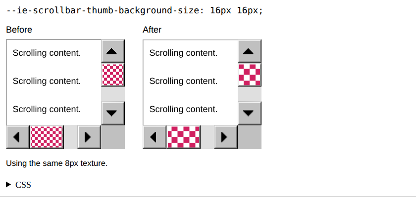</a> |
| `--ie-scrollbar-thumb-background-repeat` | `repeat` | CSS background repeat. | <a href="images/css/ie-scrollbar-thumb-background-repeat.png">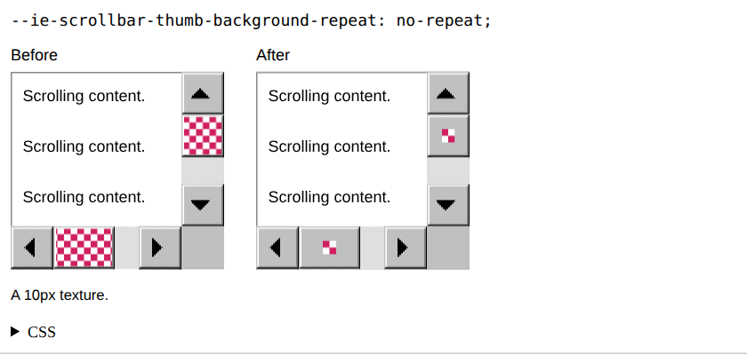</a> |
| `--ie-scrollbar-track-background-image` | `none` | CSS image or gradient. | <a href="images/css/ie-scrollbar-track-background-image.png">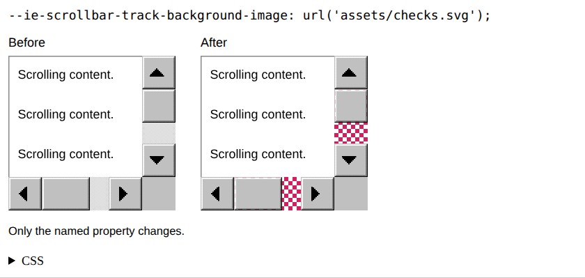</a> |
| `--ie-scrollbar-track-background-position` | `50% 50%` | CSS background position. | <a href="images/css/ie-scrollbar-track-background-position.png">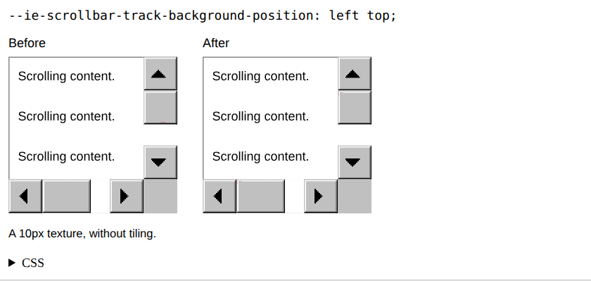</a> |
| `--ie-scrollbar-track-background-size` | `auto` | CSS background size. | <a href="images/css/ie-scrollbar-track-background-size.png">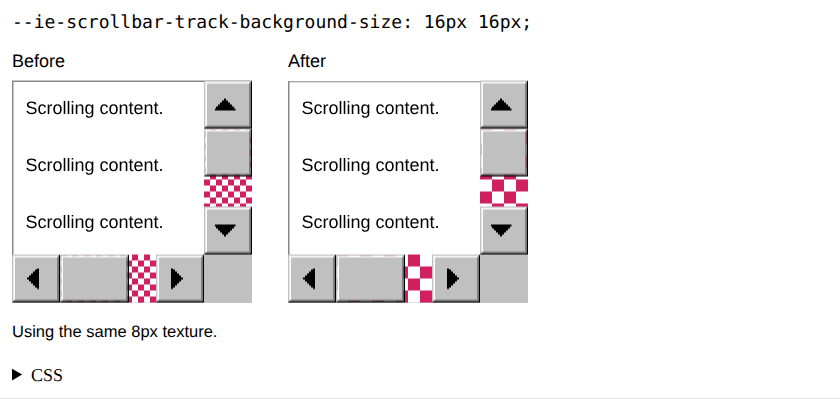</a> |
| `--ie-scrollbar-track-background-repeat` | `repeat` | CSS background repeat. | <a href="images/css/ie-scrollbar-track-background-repeat.png">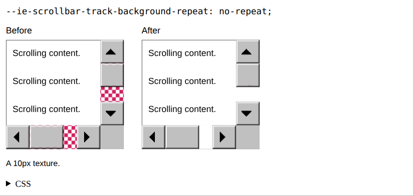</a> |

### Reading the examples

Image/texture position, size, and repeat need an image to act on. Button alignment needs a button narrower than its bar. Pressed-state examples show the controls held down. The live examples list the extra CSS under each sample.

Most photos use a device pixel ratio of 1.5. The fixed-dither example uses 2.5, where its difference becomes visible. `blocky`, `smooth`, and the dither switch are independent.

## Notes

- The look is a reimplementation, not a pixel-perfect guarantee. Thumb minimums, very short tracks, the corner fill, and arrow-repeat timing use project defaults: 32px, face colour, and 20px steps with a 400ms delay/40ms repeat.
- Legacy discovery cannot read cross-origin stylesheets or cross-origin iframes. Same-origin iframes are handled automatically. Shadow roots are not scanned; RTL bars stay on the right.
- The legacy reader handles ordinary selectors and source order, but does not implement the full CSS cascade: `!important`, `@supports`, and cascade layers are not supported. Use valid CSS colour values rather than IE's old hashless hex syntax.
- Set `--ie-scrollbar-border-inset` explicitly for asymmetric borders. A wrapped flex/grid item can lose `margin: auto` centering; center its parent instead. For absolutely positioned scrollboxes, position an outer container instead.
- Internal variables such as `--ie-button-face`, `--ie-glyph-image`, and `--ie-track-cell` are rendering details, not public options.
