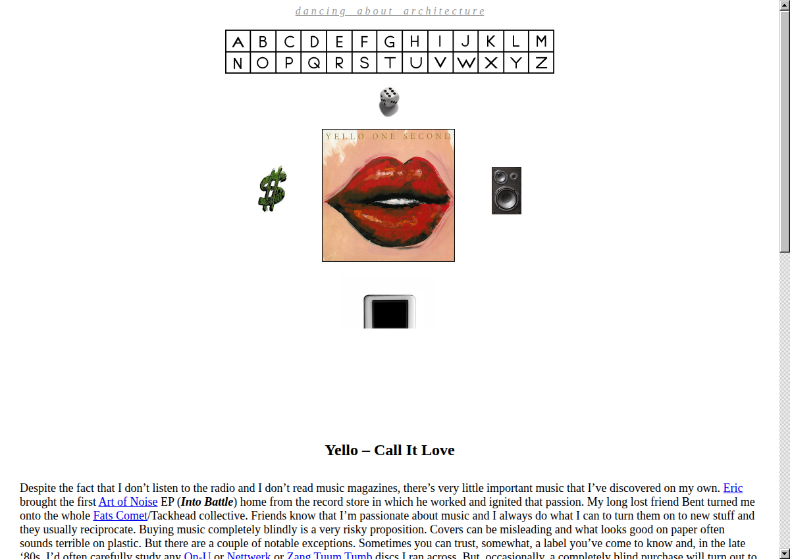
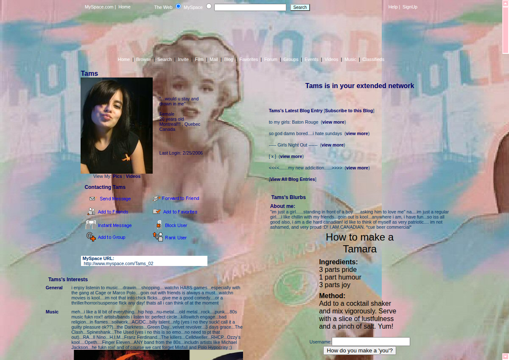
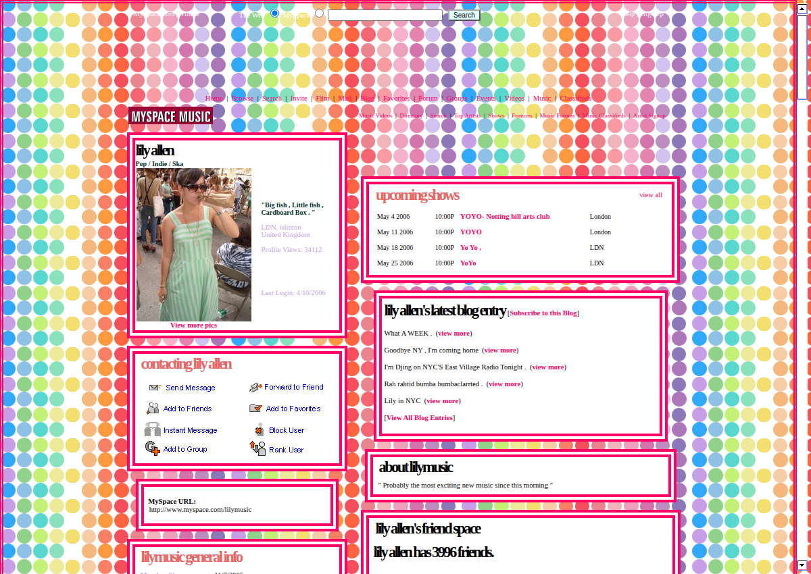
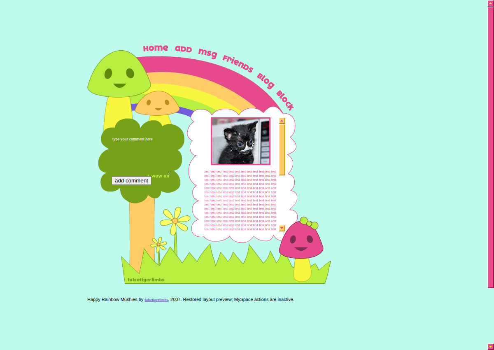

# IE Scrollbars

[](images/dance-archi.png)

[The Yello page on dance.archi](https://dance.archi/pages/yello.html), rendered with this script.

Internet Explorer [used to let websites change scrollbar colours](https://learn.microsoft.com/en-us/openspecs/ie_standards/ms-css21e/4d70b818-9655-4f86-908b-ee9bfd852290) with CSS properties like `scrollbar-face-color`. Colored scrollbars were part of the MySpace look, along with tiled backgrounds, animated GIFs, and profile music.

This script reimplements those scrollbars in modern browsers. It reads the old CSS and brings that dead code back to life. Drop it into a MySpace-era site and its supported scrollbar declarations work again.

It also adds options IE never had: different glyphs, image textures, adjustable sizes and bevels, separate button colours, and custom checkerboard tracks.

## Use

```html
<script src="ie-scrollbar.js" defer></script>
```

One file, no dependencies or build step. Scrolling elements and the page are picked up automatically. The wheel, keyboard, arrow buttons, and draggable thumb use the page's normal scroll position. Thumbs support mouse, touch, and pen dragging.

Phones keep native scrolling and scrollbars by default. To enable custom scrollbars on phones too, set `--ie-scrollbar-mobile: 1` on `:root` for the whole page, or on an individual scrolling element.

```css
body {
  scrollbar-face-color: #ffb6d9;
  scrollbar-arrow-color: #800040;
  scrollbar-track-color: #ffe5f0;
}
```

[All CSS options, with pictures](CSS.md) · [Basic example](https://dance.archi/scrollbars/)

`scrollbar-base-color` is ignored. Old hex colours need a `#`; stylesheet discovery needs same-origin CSS. Other short notes are at the end of the [reference](CSS.md#notes).

## MySpace

Two archived profiles and a restored layout preview, rendered with this script. Click a picture for the full-size screenshot.

| Tams | Lily Allen | Happy Rainbow Mushies |
| --- | --- | --- |
| <a href="images/myspace-tams.png"></a> | <a href="images/myspace-lily.png"></a> | <a href="images/myspace-rainbow.png"></a> |
| [Archive.org](https://web.archive.org/web/20060411202310/http://profile.myspace.com/index.cfm?fuseaction=user.viewProfile&friendID=2232347) | [Archive.org](https://web.archive.org/web/20060411135334/http://myspace.com/lilymusic) | [Try the layout](https://dance.archi/scrollbars/myspace/rainbow.html) · [Archive.org](https://web.archive.org/web/20090425014754/http://www.createblog.com/myspace-layouts/18351-happy-rainbow-mushies/preview/) |

Happy Rainbow Mushies is a 2007 layout by [falsetigerlimbs](https://www.createblog.com/myspace-layouts/18351-happy-rainbow-mushies/). Its original GIFs and scrollbar palettes are included in the live example. Old MySpace actions are inactive.

Old colour syntax was cleaned up where needed. [Sources and screenshot notes](images/README.md).

Try the examples live at <https://dance.archi/scrollbars/>.

[MIT license](LICENSE).
